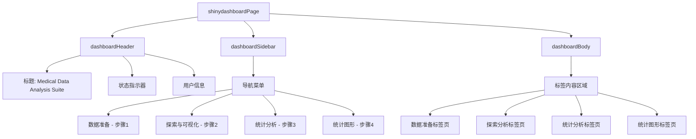

# 主应用框架设计 - shinydashboard布局

## 整体布局结构



## 导航菜单设计

### 菜单项定义
```r
sidebarMenu(
  id = "tabs",
  menuItem("1. 数据准备", 
           tabName = "data_prep", 
           icon = icon("database"),
           badgeLabel = "第一步", 
           badgeColor = "blue"),
  
  menuItem("2. 探索与可视化", 
           tabName = "explore", 
           icon = icon("chart-scatter"),
           badgeLabel = "待激活", 
           badgeColor = "gray"),
  
  menuItem("3. 统计分析", 
           tabName = "stats", 
           icon = icon("table-list"),
           badgeLabel = "待激活", 
           badgeColor = "gray"),
  
  menuItem("4. 统计图形", 
           tabName = "plots", 
           icon = icon("chart-line"),
           badgeLabel = "待激活", 
           badgeColor = "gray")
)
```

## 响应式导航逻辑

### 状态管理机制
- 使用 `shinyjs::disable()` / `shinyjs::enable()` 控制菜单项状态
- 基于反应式值 `step_completed` 跟踪完成状态
- 每个步骤完成后自动激活下一步骤

### 状态转换逻辑
```r
# 监听数据准备完成
observeEvent(clean_data(), {
  if (!is.null(clean_data())) {
    shinyjs::enable(selector = '[data-value="explore"]')
    updateTabItems(session, "tabs", "explore")
  }
})

# 监听探索分析完成  
observeEvent(exploration_done(), {
  if (exploration_done()) {
    shinyjs::enable(selector = '[data-value="stats"]')
  }
})

# 监听统计分析完成
observeEvent(analysis_done(), {
  if (analysis_done()) {
    shinyjs::enable(selector = '[data-value="plots"]')
  }
})
```

## 页面布局结构

### 数据准备页布局
```r
tabItem(tabName = "data_prep",
  fluidRow(
    box(width = 12, title = "文件上传", status = "primary", solidHeader = TRUE,
        fileInput("file_upload", label = NULL, 
                 buttonLabel = "浏览...", 
                 placeholder = "选择 .csv, .xlsx 或 .sav 文件"),
        helpText("支持 CSV, Excel, SPSS 格式。文件大小限制为 50MB。")
    )
  ),
  fluidRow(
    valueBoxOutput("var_count_box"),
    valueBoxOutput("obs_count_box")
  ),
  fluidRow(
    box(width = 12, title = "数据预览", status = "info",
        DT::dataTableOutput("raw_data_preview")
    )
  )
)
```

### 探索分析页布局
```r
tabItem(tabName = "explore",
  fluidRow(
    box(width = 3, title = "变量托盘", status = "primary",
        uiOutput("variable_tray")
    ),
    box(width = 9, title = "图形控制器", status = "warning",
        fluidRow(
          column(6, selectizeInput("plot_type_exp", "图形类型", 
                                  choices = c("散点图", "箱线图", "直方图", "条形图"))),
          column(6, actionButton("reset_mapping", "重置映射", icon = icon("refresh")))
        ),
        fluidRow(
          column(3, uiOutput("aes_x")),
          column(3, uiOutput("aes_y")), 
          column(3, uiOutput("aes_color")),
          column(3, uiOutput("aes_facet"))
        )
    )
  ),
  fluidRow(
    box(width = 12, title = "图形输出", status = "success",
        plotly::plotlyOutput("exploratory_plot", height = "600px")
    )
  )
)
```

## 响应式UI组件

### 动态值框
```r
output$var_count_box <- renderValueBox({
  req(raw_data())
  valueBox(
    ncol(raw_data()), "变量数", icon = icon("list"),
    color = "blue"
  )
})

output$obs_count_box <- renderValueBox({
  req(raw_data())
  valueBox(
    nrow(raw_data()), "观测数", icon = icon("database"),
    color = "green"
  )
})
```

## 主题和样式配置

### 自定义CSS样式
```css
/* 主要颜色主题 */
.skin-blue .main-header .logo {
  background-color: #1E88E5;
}

/* 激活菜单项样式 */
.sidebar-menu li.active > a {
  border-left-color: #1E88E5;
  font-weight: bold;
}

/* 禁用菜单项样式 */
.sidebar-menu li.disabled > a {
  color: #999;
  cursor: not-allowed;
}
```

### 响应式设计考虑
- 移动设备适配使用 `shinydashboardPlus` 的响应式特性
- 图形区域自动调整大小基于窗口尺寸
- 触摸设备优化用于拖放交互