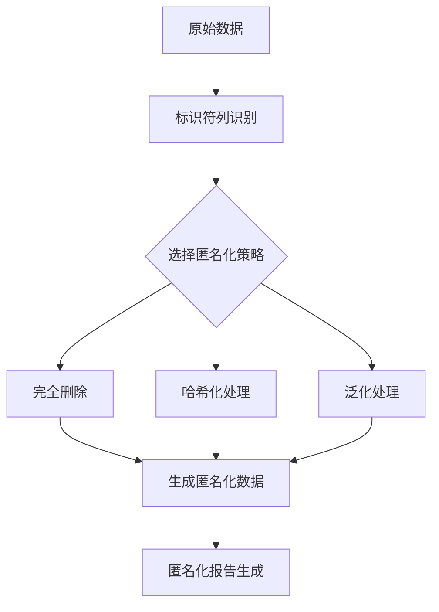

# 数据匿名化处理模块 - 实现方案

## 模块概述

数据匿名化处理模块负责识别和处理数据集中的敏感信息，如个人标识符、医疗记录号等，确保数据隐私和合规性。模块提供多种匿名化策略，包括删除、哈希化和泛化。

## 匿名化处理流程



## 标识符识别逻辑

### 智能标识符检测
```r
# 自动识别可能的标识符列
identify_pii_columns <- function(df) {
  pii_patterns <- list(
    id_pattern = c("id", "patient", "subject", "record", "case"),
    name_pattern = c("name", "first", "last", "surname", "given"),
    address_pattern = c("address", "street", "city", "zip", "postal"),
    contact_pattern = c("phone", "email", "contact", "mobile"),
    date_pattern = c("birth", "dob", "date_of_birth", "age")
  )
  
  potential_pii <- list()
  
  for (col in names(df)) {
    col_lower <- tolower(col)
    
    for (pattern_type in names(pii_patterns)) {
      if (any(sapply(pii_patterns[[pattern_type]], function(p) grepl(p, col_lower)))) {
        potential_pii[[col]] <- pattern_type
        break
      }
    }
  }
  
  return(potential_pii)
}
```

### 用户界面设计
```r
# 匿名化变量选择器
output$anon_ui <- renderUI({
  req(raw_data())
  
  pii_columns <- identify_pii_columns(raw_data())
  
  accordion(
    id = "anonymization_accordion",
    accordion_panel(
      "数据匿名化",
      icon = icon("user-secret"),
      p("选择需要匿名化的标识符列。这些列可能包含个人身份信息。"),
      
      # 自动建议的标识符列
      pickerInput(
        "anon_vars",
        label = "选择需匿名化的标识符列",
        choices = names(raw_data()),
        selected = names(pii_columns),
        multiple = TRUE,
        options = list(
          `actions-box` = TRUE,
          `selected-text-format` = "count > 3",
          `live-search` = TRUE
        )
      ),
      
      # 匿名化策略选择
      radioButtons(
        "anon_strategy",
        "匿名化策略",
        choices = c(
          "完全删除" = "delete",
          "哈希处理" = "hash",
          "部分掩码" = "mask",
          "泛化处理" = "generalize"
        ),
        selected = "delete"
      ),
      
      # 策略特定选项
      uiOutput("strategy_options_ui"),
      
      # 预览按钮
      actionButton("preview_anonymization", "预览匿名化效果", 
                  icon = icon("eye"), class = "btn-info"),
      
      # 应用按钮
      actionButton("apply_anonymization", "应用匿名化", 
                  icon = icon("shield"), class = "btn-success")
    )
  )
})
```

## 匿名化策略实现

### 哈希化处理
```r
# 安全哈希函数
hash_data <- function(data, salt = NULL) {
  if (is.null(salt)) {
    salt <- paste(sample(c(letters, LETTERS, 0:9), 16), collapse = "")
  }
  
  sapply(data, function(x) {
    if (is.na(x)) {
      NA
    } else {
      digest::digest(paste0(x, salt), algo = "sha256")
    }
  })
}
```

### 部分掩码处理
```r
# 数据掩码函数
mask_data <- function(data, mask_char = "*", preserve_chars = 2) {
  sapply(data, function(x) {
    if (is.na(x)) {
      NA
    } else {
      x_str <- as.character(x)
      n <- nchar(x_str)
      if (n <= preserve_chars * 2) {
        # 短字符串完全掩码
        paste(rep(mask_char, n), collapse = "")
      } else {
        # 保留首尾字符
        prefix <- substr(x_str, 1, preserve_chars)
        suffix <- substr(x_str, n - preserve_chars + 1, n)
        middle <- paste(rep(mask_char, n - preserve_chars * 2), collapse = "")
        paste0(prefix, middle, suffix)
      }
    }
  })
}
```

### 泛化处理
```r
# 数据泛化函数
generalize_data <- function(data, method = "range") {
  switch(method,
         "range" = {
           # 对于数值数据，转换为范围
           if (is.numeric(data)) {
             cut(data, breaks = 5, labels = FALSE)
           } else {
             # 对于分类数据，分组处理
             data
           }
         },
         "category" = {
           # 分类数据泛化
           if (is.character(data) || is.factor(data)) {
             # 基于频率分组
             freq <- table(data)
             groups <- cut(freq, breaks = 3, labels = c("Low", "Medium", "High"))
             groups[as.character(data)]
           } else {
             data
           }
         })
}
```

## 匿名化应用逻辑

### 应用匿名化策略
```r
# 应用匿名化处理
apply_anonymization <- function(df, columns, strategy, options = list()) {
  anon_df <- df
  
  for (col in columns) {
    if (col %in% names(anon_df)) {
      switch(strategy,
             "delete" = {
               anon_df[[col]] <- NULL
             },
             "hash" = {
               anon_df[[col]] <- hash_data(anon_df[[col]], options$salt)
             },
             "mask" = {
               anon_df[[col]] <- mask_data(anon_df[[col]], 
                                          options$mask_char, 
                                          options$preserve_chars)
             },
             "generalize" = {
               anon_df[[col]] <- generalize_data(anon_df[[col]], 
                                                options$generalize_method)
             })
    }
  }
  
  return(anon_df)
}
```

### 策略选项UI
```r
# 动态策略选项
output$strategy_options_ui <- renderUI({
  req(input$anon_strategy)
  
  switch(input$anon_strategy,
         "hash" = {
           textInput("hash_salt", "哈希盐值（可选）", 
                    placeholder = "留空使用随机盐值")
         },
         "mask" = {
           fluidRow(
             column(6, 
                    numericInput("preserve_chars", "保留字符数", 
                                value = 2, min = 0, max = 10)
             ),
             column(6,
                    textInput("mask_char", "掩码字符", value = "*")
             )
           )
         },
         "generalize" = {
           selectInput("generalize_method", "泛化方法",
                      choices = c("范围分组" = "range", 
                                 "频率分组" = "category"))
         },
         NULL
  )
})
```

## 预览与验证

### 匿名化预览
```r
# 匿名化预览功能
observeEvent(input$preview_anonymization, {
  req(raw_data(), input$anon_vars)
  
  preview_data <- apply_anonymization(
    head(raw_data(), 5),
    input$anon_vars,
    input$anon_strategy,
    list(
      salt = input$hash_salt,
      mask_char = input$mask_char,
      preserve_chars = input$preserve_chars,
      generalize_method = input$generalize_method
    )
  )
  
  showModal(modalDialog(
    title = "匿名化预览",
    DT::renderDataTable({
      DT::datatable(preview_data, options = list(dom = 't'))
    }),
    size = "l",
    easyClose = TRUE
  ))
})
```

### 匿名化报告
```r
# 生成匿名化报告
generate_anonymization_report <- function(original_df, anon_df, anon_cols, strategy) {
  report <- list(
    timestamp = Sys.time(),
    original_cols = ncol(original_df),
    anon_cols = ncol(anon_df),
    columns_processed = anon_cols,
    strategy = strategy,
    details = list()
  )
  
  for (col in anon_cols) {
    report$details[[col]] <- list(
      original_type = class(original_df[[col]]),
      original_unique = length(unique(original_df[[col]])),
      anon_type = if (col %in% names(anon_df)) class(anon_df[[col]]) else "REMOVED",
      anon_unique = if (col %in% names(anon_df)) length(unique(anon_df[[col]])) else 0
    )
  }
  
  return(report)
}
```

## 安全与合规性

### 审计日志
```r
# 匿名化操作审计日志
anonymization_audit_log <- reactiveValues()
observeEvent(input$apply_anonymization, {
  req(raw_data(), input$anon_vars)
  
  # 应用匿名化
  anon_data <- apply_anonymization(
    raw_data(),
    input$anon_vars,
    input$anon_strategy,
    list(
      salt = input$hash_salt,
      mask_char = input$mask_char,
      preserve_chars = input$preserve_chars,
      generalize_method = input$generalize_method
    )
  )
  
  # 生成报告
  report <- generate_anonymization_report(
    raw_data(), anon_data, input$anon_vars, input$anon_strategy
  )
  
  # 记录审计日志
  anonymization_audit_log$last_operation <- report
  anonymization_audit_log$history <- c(
    anonymization_audit_log$history,
    list(report)
  )
  
  # 更新反应式数据
  clean_data(anon_data)
  
  showNotification("匿名化处理完成", type = "message")
})
```

### 合规性检查
```r
# 匿名化合规性验证
check_anonymization_compliance <- function(df) {
  # 检查是否还有明显的PII
  pii_columns <- identify_pii_columns(df)
  if (length(pii_columns) > 0) {
    showNotification(
      paste("警告：检测到可能的标识符列:", paste(names(pii_columns), collapse = ", ")),
      type = "warning", duration = 10
    )
  }
  
  # 检查重标识风险
  risk_score <- calculate_reidentification_risk(df)
  if (risk_score > 0.7) {
    showNotification(
      paste("高重标识风险得分:", round(risk_score, 2), "建议进一步匿名化"),
      type = "error", duration = 10
    )
  }
}
```

## 用户体验优化

### 智能建议系统
```r
# 基于数据特征的匿名化建议
observe({
  req(raw_data())
  
  pii_columns <- identify_pii_columns(raw_data())
  if (length(pii_columns) > 0) {
    showNotification(
      paste("检测到可能的标识符列:", paste(names(pii_columns), collapse = ", ")),
      type = "info", duration = 8
    )
    
    # 自动选择建议的列
    updatePickerInput(session, "anon_vars", selected = names(pii_columns))
  }
})
```

### 批量操作支持
```r
# 批量匿名化操作
observeEvent(input$anon_all_suggested, {
  pii_columns <- identify_pii_columns(raw_data())
  updatePickerInput(session, "anon_vars", selected = names(pii_columns))
})

observeEvent(input$anon_none, {
  updatePickerInput(session, "anon_vars", selected = character(0))
})
```

这个数据匿名化处理模块提供了完整的隐私保护解决方案，从自动标识符检测到多种匿名化策略，确保医疗数据在处理过程中的安全性和合规性。