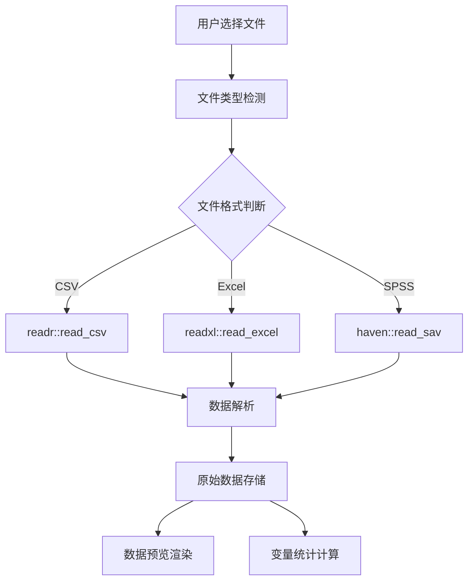

# 文件上传与数据预览功能设计

## 文件上传处理流程



## 多格式文件支持实现

### 文件读取逻辑
```r
# 反应式文件读取函数
raw_data <- reactive({
  req(input$file_upload)
  
  file <- input$file_upload
  ext <- tools::file_ext(file$datapath)
  
  tryCatch({
    switch(ext,
           csv = readr::read_csv(file$datapath, show_col_types = FALSE),
           xlsx = readxl::read_excel(file$datapath),
           xls = readxl::read_excel(file$datapath),
           sav = haven::read_sav(file$datapath),
           stop("不支持的文件格式")
    )
  }, error = function(e) {
    showNotification(paste("文件读取错误:", e$message), type = "error")
    NULL
  })
})
```

### 文件类型验证
```r
# 文件输入验证
observeEvent(input$file_upload, {
  file <- input$file_upload
  if (is.null(file)) return()
  
  # 检查文件大小 (50MB限制)
  if (file$size > 50 * 1024 * 1024) {
    showNotification("文件大小超过50MB限制", type = "error")
    reset("file_upload")
    return()
  }
  
  # 检查文件格式
  ext <- tools::file_ext(file$name)
  if (!ext %in% c("csv", "xlsx", "xls", "sav")) {
    showNotification("仅支持 CSV, Excel, SPSS 格式", type = "error")
    reset("file_upload")
    return()
  }
})
```

## 数据预览界面设计

### 实时数据预览表格
```r
output$raw_data_preview <- DT::renderDataTable({
  req(raw_data())
  
  DT::datatable(
    head(raw_data(), 10),
    options = list(
      scrollX = TRUE,
      pageLength = 5,
      dom = 't',
      autoWidth = TRUE
    ),
    rownames = FALSE,
    class = 'cell-border stripe'
  )
})
```

### 智能信息显示
```r
# 变量数量显示
output$var_count_box <- renderValueBox({
  req(raw_data())
  valueBox(
    ncol(raw_data()), "变量数", 
    icon = icon("list"),
    color = "blue",
    width = 4
  )
})

# 观测值数量显示
output$obs_count_box <- renderValueBox({
  req(raw_data())
  valueBox(
    format(nrow(raw_data()), big.mark = ","), "观测数", 
    icon = icon("database"),
    color = "green",
    width = 4
  )
})

# 文件信息显示
output$file_info_box <- renderValueBox({
  req(input$file_upload)
  valueBox(
    tools::file_ext(input$file_upload$name), "文件格式", 
    icon = icon("file"),
    color = "purple",
    width = 4
  )
})
```

## 数据质量检查

### 基本数据完整性检查
```r
# 反应式数据质量报告
data_quality_report <- reactive({
  req(raw_data())
  
  df <- raw_data()
  list(
    total_rows = nrow(df),
    total_cols = ncol(df),
    missing_values = sum(is.na(df)),
    duplicate_rows = sum(duplicated(df)),
    numeric_cols = sum(sapply(df, is.numeric)),
    character_cols = sum(sapply(df, is.character)),
    factor_cols = sum(sapply(df, is.factor)),
    date_cols = sum(sapply(df, function(x) inherits(x, "Date")))
  )
})
```

### 实时数据质量监控
```r
# 数据质量可视化
output$data_quality_plot <- renderPlot({
  req(data_quality_report())
  
  report <- data_quality_report()
  quality_data <- data.frame(
    Metric = c("缺失值", "重复行", "数值变量", "字符变量"),
    Count = c(report$missing_values, report$duplicate_rows, 
              report$numeric_cols, report$character_cols),
    Type = c("问题", "问题", "变量类型", "变量类型")
  )
  
  ggplot(quality_data, aes(x = Metric, y = Count, fill = Type)) +
    geom_bar(stat = "identity") +
    theme_minimal() +
    labs(title = "数据质量概览", x = "", y = "数量") +
    scale_fill_manual(values = c("问题" = "red", "变量类型" = "blue"))
})
```

## 错误处理与用户反馈

### 健壮的错误处理机制
```r
# 全局错误处理
observeEvent(raw_data(), {
  if (is.null(raw_data())) {
    showNotification("无法读取文件，请检查文件格式和内容", 
                    type = "error", duration = 5)
  } else {
    showNotification("文件读取成功，开始数据预处理", 
                    type = "message", duration = 3)
    
    # 自动展开预处理面板
    runjs('$("#preprocess-accordion").collapse("show");')
  }
})

### 文件读取状态指示
output$file_status <- renderUI({
  if (is.null(raw_data())) {
    tags$div(class = "alert alert-warning", 
             icon("exclamation-triangle"), 
             "等待文件上传...")
  } else {
    tags$div(class = "alert alert-success", 
             icon("check-circle"), 
             "文件已就绪，可进行预处理")
  }
})
```

## 用户体验优化

### 拖放上传支持
```r
# 添加拖放功能
tags$script('
  $(document).on("shiny:connected", function() {
    $("#file_upload").closest(".form-group").addClass("dropzone");
    $(".dropzone").on("dragover", function(e) {
      e.preventDefault();
      $(this).addClass("dz-dragging");
    });
    $(".dropzone").on("dragleave drop", function(e) {
      e.preventDefault();
      $(this).removeClass("dz-dragging");
    });
  });
')
```

### 上传进度指示
```r
# 进度条实现
output$upload_progress <- renderUI({
  if (is.null(input$file_upload)) return(NULL)
  
  tags$div(
    class = "progress",
    tags$div(
      class = "progress-bar progress-bar-striped active",
      role = "progressbar",
      style = "width: 100%",
      "处理中..."
    )
  )
})
```

## 性能优化考虑

### 大数据集处理策略
- 使用 `data.table::fread` 对于大型CSV文件
- 实现分块读取和显示
- 延迟渲染避免界面冻结
- 内存使用监控和警告

### 响应式更新优化
- 使用 `req()` 和 `validate()` 确保数据可用性
- 实现防抖和节流控制更新频率
- 缓存计算结果减少重复处理