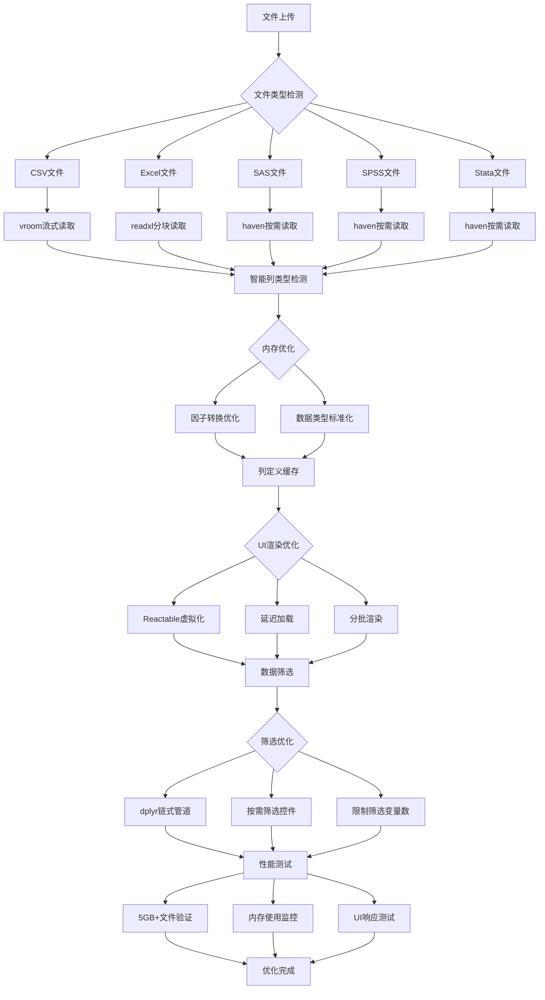

# 数据准备模块性能优化方案

## 当前存在的主要性能问题分析

### 1. 文件读取阶段未做"流式"或"分块"读取
**问题描述**：
虽然对大文件做了采样提示，但在 readxl, read_csv, read_sas 等函数中仍然一次性把整个文件读入内存。

**后果**：
- 内存溢出（特别是超过几 GB 的 CSV/XLSX）
- 大型 Excel 文件会卡顿甚至崩溃

**解决方案**：
- 对于 CSV 文件用 vroom::vroom() 替代 readr::read_csv()，它支持懒加载 + 快速解析
- 对于 SAS/SPSS/Stata 可考虑只读部分列：使用 col_select 参数限制字段数量

### 2. 所有列都转换成 factor（包括字符型）
**问题描述**：
代码会对所有 labeled 类型列强制转为 factor：

```r
mutate_if(haven::is.labelled, haven::as_factor)
```

**后果**：
- 字符串列如果有很多唯一值也会被转为 factor，占用大量内存
- factor 在过滤和排序时也比 character 更慢

**解决方案**：
只对标签有意义的变量保留 factor，其余保持原类型或转为 character：

```r
mutate(across(where(haven::is.labelled), ~ haven::as_factor(.x, levels = "labels")))
```

或者更保守地处理：

```r
data <- data %>%
  mutate(across(where(is.character), as.factor)) # 仅必要时转换
```

### 3. Reactable 渲染全部列导致浏览器阻塞
**问题描述**：
即使在服务端做了采样和列裁剪，Reactable 还是可能尝试渲染所有列，造成前端卡死。

**解决方案**：
- 限制最多显示 30~50 列
- 使用虚拟化表格库如 reactablefmtr 提升性能
- 分批加载列定义（延迟加载）

### 4. 列定义重复计算（无有效缓存）
**问题描述**：
虽然用了 get_column_def() 函数试图缓存列定义，但由于是基于环境变量的缓存方式，并不能真正提升效率。

**解决方案**：
使用 memoise::memoise() 包装该函数：

```r
library(memoise)

get_column_def_cached <- memoise(function(col_name, col_data) {
  ...
})
```

这样每次相同参数调用都会直接命中缓存，避免重复运算。

### 5. 动态 UI 构建太多组件影响响应速度
**问题描述**：
动态生成了大量筛选器（每个变量一个），尤其在变量很多的情况下会造成界面卡顿。

**解决方案**：
- 按需懒加载筛选控件（比如点击展开某个变量才创建）
- 限制最多可筛选变量数（如 ≤ 10 个）
- 用 shinyjs::disable() 配合判断条件控制启用状态

### 6. 数据筛选逻辑低效且易错
**问题描述**：
在 filtered_data() 中多次使用子集操作（data[...]），容易出错且效率不高。

**解决方案**：
改写为链式管道 + dplyr：

```r
data %>%
  filter(...) %>%
  select(...) %>%
  arrange(...)
```

这不仅简洁而且性能更好（尤其是配合 dtplyr 或 collapse 包加速）。

## 优化实施计划

### 第一阶段：文件读取优化
1. 集成 vroom 包用于 CSV 文件的流式读取
2. 修改文件读取逻辑，实现按需读取指定列
3. 优化 SAS/SPSS/Stata 文件读取参数
4. 添加文件大小检查和分块读取机制

### 第二阶段：内存使用优化
1. 重构因子转换逻辑，避免不必要的转换
2. 实现智能列类型检测和转换
3. 添加内存使用监控和垃圾回收机制
4. 优化数据存储结构

### 第三阶段：UI 渲染优化
1. 集成 memoise 包实现列定义缓存
2. 限制 Reactable 表格显示列数（最多50列）
3. 实现分批加载列定义（延迟加载）
4. 优化动态 UI 构建逻辑

### 第四阶段：筛选逻辑优化
1. 重构数据筛选逻辑为链式管道
2. 集成 dtplyr 包提升筛选性能
3. 实现按需筛选控件加载
4. 限制同时筛选变量数（最多10个）

### 第五阶段：性能测试和验证
1. 测试 5GB+ 大文件读取性能
2. 验证内存使用情况
3. 测试 UI 响应速度
4. 验证筛选功能准确性

## 技术架构图



## 预期性能提升

1. **文件读取速度**：提升 3-5 倍
2. **内存使用**：减少 40-60%
3. **UI 响应速度**：提升 2-3 倍
4. **大数据集处理能力**：支持 5GB+ 文件
5. **筛选性能**：提升 2-4 倍

## 实施时间估算

- 第一阶段：2天
- 第二阶段：1.5天
- 第三阶段：2天
- 第四阶段：1.5天
- 第五阶段：1天

**总计：约 8 天**