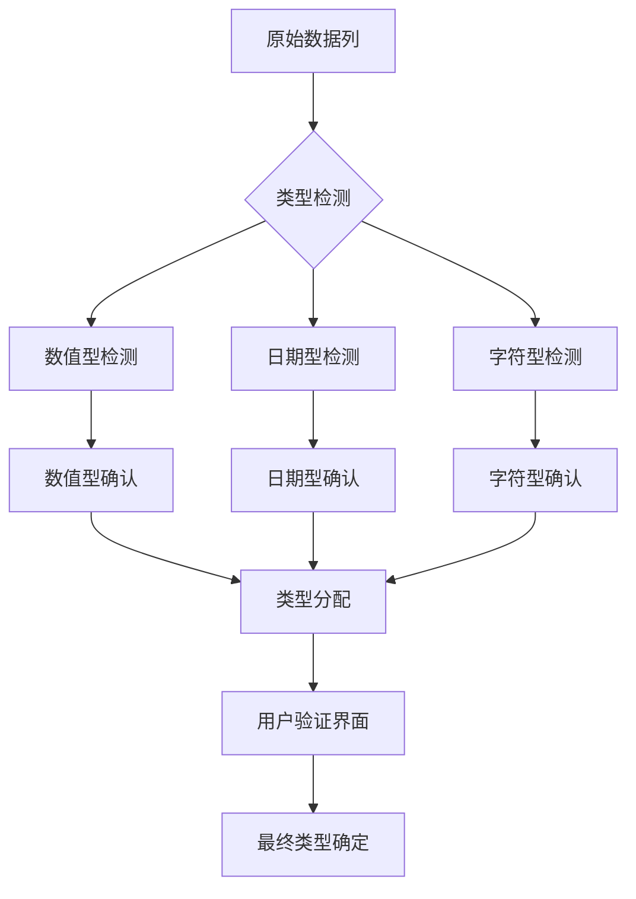

# 智能变量类型识别系统 - 技术规范

## 系统概述

智能变量类型识别系统是数据预处理的核心组件，能够自动推断数据集中每个变量的类型，并提供用户友好的界面进行手动修正。系统支持数值型、字符型（分类）、日期型三种主要变量类型。

## 类型识别算法流程



## 类型检测逻辑

### 数值型检测算法
```r
# 数值型变量识别函数
is_likely_numeric <- function(x) {
  # 转换因子为字符
  if (is.factor(x)) x <- as.character(x)
  
  # 移除NA值
  x <- x[!is.na(x)]
  if (length(x) == 0) return(FALSE)
  
  # 检查是否可以转换为数值
  converted <- suppressWarnings(as.numeric(x))
  na_count <- sum(is.na(converted))
  
  # 如果超过95%的值可以转换，认为是数值型
  conversion_rate <- 1 - (na_count / length(x))
  conversion_rate > 0.95
}
```

### 日期型检测算法
```r
# 日期型变量识别函数
is_likely_date <- function(x) {
  # 转换因子为字符
  if (is.factor(x)) x <- as.character(x)
  
  # 移除NA值
  x <- x[!is.na(x)]
  if (length(x) == 0) return(FALSE)
  
  # 常见日期格式模式
  date_patterns <- c(
    "\\d{4}-\\d{2}-\\d{2}",      # YYYY-MM-DD
    "\\d{2}/\\d{2}/\\d{4}",      # MM/DD/YYYY
    "\\d{2}-\\d{2}-\\d{4}",      # DD-MM-YYYY
    "\\d{4}/\\d{2}/\\d{2}",      # YYYY/MM/DD
    "\\d{1,2}/\\d{1,2}/\\d{2,4}" # M/D/YY or M/D/YYYY
  )
  
  # 检查是否匹配日期模式
  date_matches <- sapply(date_patterns, function(pattern) {
    sum(grepl(pattern, x)) / length(x)
  })
  
  # 如果任何模式匹配率超过80%，认为是日期型
  any(date_matches > 0.8)
}
```

### 字符型/分类变量检测
```r
# 分类变量识别函数
is_likely_categorical <- function(x) {
  # 转换因子为字符
  if (is.factor(x)) x <- as.character(x)
  
  # 移除NA值
  x <- x[!is.na(x)]
  if (length(x) == 0) return(FALSE)
  
  # 计算唯一值比例
  unique_ratio <- length(unique(x)) / length(x)
  
  # 如果唯一值比例低且不是数值/日期，认为是分类变量
  unique_ratio < 0.3 && !is_likely_numeric(x) && !is_likely_date(x)
}
```

## 类型推断主函数

```r
# 智能类型推断函数
infer_variable_types <- function(df) {
  types <- sapply(df, function(col) {
    if (is_likely_numeric(col)) {
      "numeric"
    } else if (is_likely_date(col)) {
      "date"
    } else if (is_likely_categorical(col)) {
      "categorical"
    } else {
      "character"
    }
  })
  
  # 创建类型信息数据框
  type_info <- data.frame(
    variable = names(types),
    inferred_type = types,
    final_type = types,  # 初始与推断类型相同
    stringsAsFactors = FALSE
  )
  
  # 添加统计信息
  type_info$unique_values <- sapply(df, function(x) length(unique(x)))
  type_info$missing_values <- sapply(df, function(x) sum(is.na(x)))
  type_info$missing_percent <- round(type_info$missing_values / nrow(df) * 100, 2)
  
  return(type_info)
}
```

## 用户界面设计

### 类型修正界面
```r
# 动态类型选择器UI
output$variable_type_ui <- renderUI({
  req(raw_data())
  req(type_info())
  
  accordion(
    id = "type_accordion",
    accordion_panel(
      "变量类型确认",
      icon = icon("magnifying-glass"),
      p("请确认系统自动识别的变量类型是否正确。错误类型将导致某些分析不可用。"),
      br(),
      lapply(1:nrow(type_info()), function(i) {
        var_info <- type_info()[i, ]
        fluidRow(
          column(4, 
                 tags$strong(var_info$variable),
                 tags$br(),
                 tags$small(paste("唯一值:", var_info$unique_values, 
                                 "缺失值:", var_info$missing_values))
          ),
          column(4,
                 selectInput(
                   inputId = paste0("type_", var_info$variable),
                   label = NULL,
                   choices = c("数值型" = "numeric", 
                              "字符型(分类)" = "categorical", 
                              "日期型" = "date"),
                   selected = var_info$inferred_type
                 )
          ),
          column(4,
                 uiOutput(paste0("type_icon_", var_info$variable))
          )
        )
      })
    )
  )
})
```

### 类型图标显示
```r
# 类型图标显示
observe({
  req(type_info())
  
  lapply(type_info()$variable, function(var) {
    output[[paste0("type_icon_", var)]] <- renderUI({
      current_type <- input[[paste0("type_", var)]]
      icon_name <- switch(current_type,
                         "numeric" = "123",
                         "categorical" = "abc",
                         "date" = "calendar")
      color <- switch(current_type,
                     "numeric" = "blue",
                     "categorical" = "green", 
                     "date" = "orange")
      
      tags$span(icon(icon_name), style = paste0("color:", color, "; font-size: 20px;"))
    })
  })
})
```

## 类型应用逻辑

### 类型转换函数
```r
# 应用类型转换
apply_variable_types <- function(df, type_selections) {
  for (var in names(type_selections)) {
    type <- type_selections[[var]]
    
    switch(type,
           "numeric" = {
             df[[var]] <- as.numeric(df[[var]])
           },
           "categorical" = {
             df[[var]] <- as.factor(df[[var]])
           },
           "date" = {
             # 尝试多种日期格式
             df[[var]] <- parse_date_time(df[[var]], 
                                         orders = c("ymd", "mdy", "dmy", "ymd HM"))
           }
    )
  }
  return(df)
}
```

### 类型选择收集
```r
# 收集用户类型选择
type_selections <- reactive({
  req(type_info())
  
  selections <- list()
  for (var in type_info()$variable) {
    input_id <- paste0("type_", var)
    if (!is.null(input[[input_id]])) {
      selections[[var]] <- input[[input_id]]
    }
  }
  selections
})
```

## 智能提示系统

### 类型冲突检测
```r
# 类型冲突检测和提示
observe({
  req(type_selections())
  
  # 检查数值型变量是否有过多唯一值（可能应该是分类变量）
  numeric_vars <- names(type_selections())[type_selections() == "numeric"]
  for (var in numeric_vars) {
    unique_count <- length(unique(raw_data()[[var]]))
    if (unique_count < 10) {
      showNotification(
        paste("变量", var, "被设为数值型，但只有", unique_count, 
              "个唯一值。考虑设为分类变量？"),
        type = "warning", duration = 5
      )
    }
  }
  
  # 检查分类变量是否有过多唯一值
  categorical_vars <- names(type_selections())[type_selections() == "categorical"]
  for (var in categorical_vars) {
    unique_count <- length(unique(raw_data()[[var]]))
    if (unique_count > 50) {
      showNotification(
        paste("变量", var, "被设为分类变量，但有", unique_count, 
              "个唯一值。这可能影响性能。"),
        type = "warning", duration = 5
      )
    }
  }
})
```

## 性能优化

### 延迟类型推断
```r
# 使用debounce避免频繁计算
type_info <- reactive({
  req(raw_data())
  infer_variable_types(raw_data())
}) %>% debounce(1000)  # 1秒防抖
```

### 内存高效处理
```r
# 采样检测对于大型数据集
is_likely_numeric <- function(x, sample_size = 1000) {
  if (length(x) > sample_size) {
    x <- sample(x, sample_size)
  }
  # 其余检测逻辑...
}
```

## 用户体验特性

### 类型更改历史
```r
# 记录类型更改历史
type_change_history <- reactiveValues()
observe({
  req(type_selections())
  
  for (var in names(type_selections())) {
    current_type <- type_selections()[[var]]
    original_type <- type_info()$inferred_type[type_info()$variable == var]
    
    if (current_type != original_type) {
      type_change_history[[var]] <- list(
        from = original_type,
        to = current_type,
        timestamp = Sys.time()
      )
    }
  }
})
```

### 批量类型操作
```r
# 批量设置类型
observeEvent(input$bulk_set_numeric, {
  # 将所有选中变量设为数值型
})

observeEvent(input$bulk_set_categorical, {
  # 将所有选中变量设为分类
})
```

这个智能变量类型识别系统提供了强大的自动推断能力，同时给予用户充分的控制权，确保数据类型的准确性为后续分析奠定基础。
